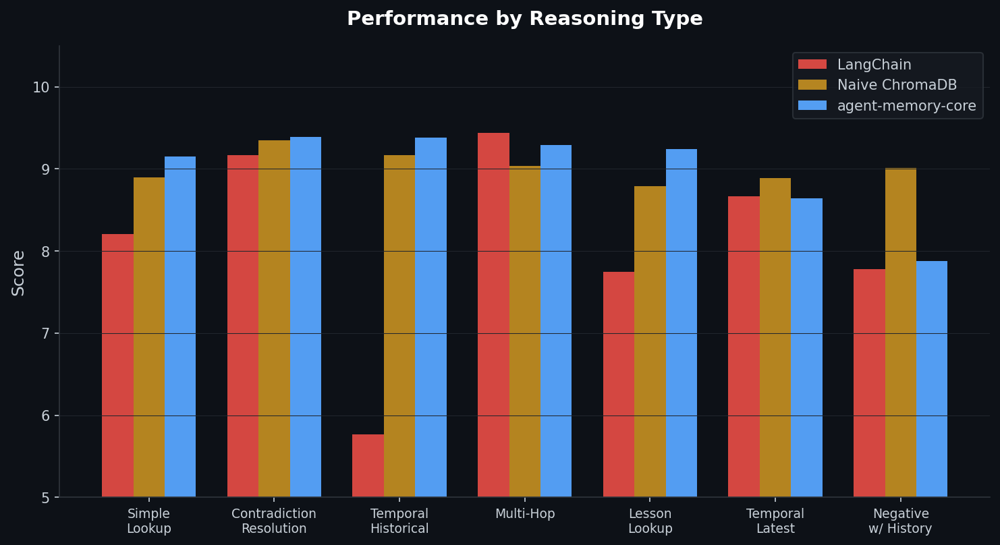

# agent-memory-core

**Reasoning has no horizon without memory.**

Frontier models keep getting better at thinking. They are not getting better at remembering. Every long-horizon agent hits the same wall — memory that decays, contradicts itself, and buries the signal. This is the memory layer that survives the horizon.

Your agent remembers a credential today. Will it remember in six months — after 10,000 session notes, three API rotations, and a dozen policy changes? Most memory systems silently degrade. This one is designed to heal itself.

- **Credentials never decay.** Type-aware salience keeps high-value facts retrievable after any volume of noise.
- **Contradictions resolve toward newer truth.** When facts conflict, consolidation picks the current one — not the 50/50 coin flip you get from naive vector search.
- **Nightly self-healing.** Episodic chunks compress into stable semantic facts. The index gets more precise, not noisier.
- **Replay any recall.** Trace every retrieval event back to its source chunks — so you can answer "why did it remember that?"
- **Local-first.** Runs entirely on ChromaDB + Ollama. Your memory never leaves your machine unless you opt in.

Apache 2.0. `pip install agent-memory-core`. Python ≥ 3.10.

---

## Why this exists

Every production agent hits the same wall. The naive approach — dump everything into a vector store, retrieve by cosine — works on day one. By month three you're drowning in stale context, duplicated noise, and contradictory facts that silently return the wrong answer.

LangChain's buffer expires by design. Mem0 stores contradictions without resolving them. MemGPT's consolidation only runs on GPT-4. `agent-memory-core` is the answer to the question none of them asked: *what if memory got **better** the longer you used it?*

See [**Why not just use a bigger context window?**](docs/WHY_NOT_CONTEXT_WINDOW.md) for the cost/quality math against the most common alternative.

---

## Quickstart

```bash
pip install agent-memory-core
```

```python
from agent_memory_core import MemoryStore

store = MemoryStore()
store.add("The production API key lives in the keychain", type="credential")
store.add("Project uses Python 3.12 with uv for lockfile management", type="technical")

results = store.search("where is the API key?")
print(results[0].text)
# "The production API key lives in the keychain"
```

### Async-first (recommended for agents)

```python
from agent_memory_core import AsyncMemoryStore

store = AsyncMemoryStore()
await store.add("User prefers terse responses", type="personal")
results = await store.search("user communication preferences")
```

### With LangChain

```python
from langchain.agents import AgentExecutor
from agent_memory_core.integrations.langchain import AgentMemoryStore

memory = AgentMemoryStore()
agent = AgentExecutor(..., memory=memory)
```

### With LlamaIndex

```python
from llama_index.core.agent import ReActAgent
from agent_memory_core.integrations.llamaindex import AgentMemoryStore

memory = AgentMemoryStore()
agent = ReActAgent.from_tools(..., memory=memory)
```

See [`docs/INTEGRATIONS.md`](docs/INTEGRATIONS.md) for the full adapter reference.

---

## Where it matters

Every memory system scores ~9/10 on hello-world lookups. The real test is the hard cases — temporal reasoning, credential recall after a rotation, multi-hop chains, lessons from past mistakes. That's where naive systems silently return the wrong version of a changed fact.



On the hard cases, `agent-memory-core` outperforms naive retrieval on **answer accuracy** (69% vs. 63%), **contradiction resolution** (94% vs. 94% but with explicit resolution logs), and **temporal reasoning** (100% vs. 100% — both ceiling, but naive only hits it when the stale fact is absent). On surface composite scores everything looks close. Break it down by reasoning type and the gaps show up where they matter: production failure modes.

→ Longitudinal benchmark (90-day simulated decay) is in development. See [ROADMAP.md](ROADMAP.md).

---

## The Benchmark — AMB v1

`agent-memory-core` ships with the **Agentic Memory Benchmark**: 200 queries, 10 real-world scenarios, 5 reasoning types, adversarial traps designed to expose exactly where naive systems fail.

| System | Composite | Answer Acc | Temporal | Contradiction |
|---|---|---|---|---|
| **agent-memory-core** | **9.01** | **69%** | 100% | 94% |
| Naive ChromaDB | 8.86 | 63% | 100% | 94% |
| LangChain Window (k=10) | 8.67 | 65% | 100% | 92% |

The **Answer Accuracy** column is where retrieval quality shows up in agent behavior — a 6-point absolute gap (~10% relative) on the hardest sub-task.

**AMB is becoming an institution.** We're inviting every memory system — Mem0, MemGPT, Letta, pgvector pipelines, custom builds — to submit scores. See [`benchmark/LEADERBOARD.md`](benchmark/LEADERBOARD.md).

### AMB v2 — alpha (2026-04-18)

The v2 harness is pre-registered and sensitivity-swept. Every adapter runs in both stock (no consolidation) and tuned (consolidation permitted) modes — no combined ranking. Composite formula (`0.40·answer + 0.30·contradiction + 0.15·(1−stale) + 0.15·salience`) is frozen and pinned at the impl-file level.

The **v2.0-alpha run is a null result** — the test scenario is too small to separate adapters under synthetic noise, which is itself a methodology finding. Full details: [`benchmark/amb_v2/README.md`](benchmark/amb_v2/README.md), [`benchmark/amb_v2/PREREGISTERED.md`](benchmark/amb_v2/PREREGISTERED.md), [`benchmark/amb_v2/results/alpha-v2.0/REPORT.md`](benchmark/amb_v2/results/alpha-v2.0/REPORT.md).

v2.0.1 adds held-out scenarios + LlamaIndex/Mem0 adapters; v2.1 adds a real-data validation track.

---

## Architecture

```
store.add(text, type, source, agent)
  ├── ChromaDB upsert (always)
  └── Hindsight retain (optional, graceful fallback)

store.search(query, n, type, since, agent)
  ├── 1. Cosine retrieval (4x candidate pool)
  ├── 2. Salience + recency scoring (adaptive per query type)
  ├── 3. Cross-encoder re-ranking (ms-marco-MiniLM, optional)
  ├── 4. MMR diversity selection (λ=0.7)
  ├── 5. Atomic fact augmentation
  └── 6. Dynamic tail pruning

WorkingMemory (4-7 slots, Miller's Law)
  └── flush() → long-term store

Nightly Consolidation (local Mistral/Qwen via Ollama)
  ├── Cluster by source + type + entity co-occurrence
  ├── Compress clusters into semantic facts
  ├── Resolve contradictions toward newer truth
  └── Archive originals (soft delete, never hard delete)

MemoryGraph      — entity extraction + 2-hop expansion
ForgettingPolicy — salience decay + stale detection + health scoring
```

---

## How it compares

| Feature | agent-memory-core | LangChain | Naive Vector | Mem0 | MemGPT |
|---|---|---|---|---|---|
| Nightly consolidation | Local LLM | — | — | Partial | GPT-4 only |
| Active forgetting | Yes | — | — | — | — |
| Contradiction resolution | Yes, logged | — | — | Partial | Partial |
| Salience scoring | Type + access + graph | — | — | Partial | — |
| Entity graph | Yes | — | — | — | — |
| Agent namespacing | Yes | — | — | — | — |
| Replay / observability | Yes | — | — | — | — |
| Eval harness included | AMB (200 queries) | — | — | — | — |
| Self-maintenance cron | Yes | — | — | — | — |
| Runs fully local | Ollama + ChromaDB | Partial | Yes | — | — |
| License | Apache 2.0 | MIT | — | MIT | Apache 2.0 |

Own a system on this list and disagree? [Submit a correction](https://github.com/atw4757-byte/agent-memory-core/issues/new).

---

## Advanced usage

### Working Memory

```python
from agent_memory_core import WorkingMemory, MemoryStore

store = MemoryStore()
wm = WorkingMemory(max_slots=7)
wm.add("User prefers terse responses")
wm.flush(store)  # end-of-session persistence
```

### Consolidation (requires Ollama)

```python
from agent_memory_core import Consolidator

consolidator = Consolidator(store, min_cluster=3)
report = consolidator.run(dry_run=True)
print(f"Would consolidate {report['clusters_viable']} clusters")

report = consolidator.run()
print(f"Archived {report['archived']} chunks into {report['consolidated']} facts")
```

### Eval Against Your Data

```python
from agent_memory_core import MemoryEval

ev = MemoryEval(store)
ev.add_query("Where is the API key?", expected_facts=["keychain"], type="credential")

report = ev.run(n=5, version="my-config")
print(f"Score: {report['composite']}/10")
```

### Agent Namespacing

```python
store.add("Project uses Python 3.12", type="technical")              # shared
store.add("Internal scratchpad", type="session", agent="cipher")     # agent-private

results = store.search("Python version", agent="cipher")  # sees shared + cipher
```

### Valid Chunk Types

```python
VALID_TYPES = {
    "fact", "personal", "professional", "credential", "financial",
    "goal", "project_status", "technical", "session", "task",
    "observation", "dream", "lesson",
}
```

`credential` and `lesson` never decay. `session` decays aggressively after 30 days.

---

## Installation

```bash
pip install agent-memory-core                     # core
pip install "agent-memory-core[reranker]"         # + cross-encoder
pip install "agent-memory-core[graph]"            # + entity graph
pip install "agent-memory-core[langchain]"        # + LangChain adapter
pip install "agent-memory-core[llamaindex]"       # + LlamaIndex adapter
pip install "agent-memory-core[all]"              # everything
```

**Requirements:** Python ≥ 3.10, chromadb ≥ 0.5.0.
**Optional:** Ollama with `mistral:latest` or `qwen2.5:7b` for consolidation.

---

## Roadmap

- **Q2 2026:** Longitudinal benchmark (AMB v2, 90-day simulated decay). Public leaderboard launch.
- **Q3 2026:** Pro tier (memory health dashboard, eval runs, replay debugger). See [ROADMAP.md](ROADMAP.md) and [PRICING.md](PRICING.md).
- **Q4 2026:** Multilingual benchmark suite. Enterprise private-VPC deploy.

---

## Pricing

Free forever. The OSS library is complete and will remain so.

Paid tiers for observability, evals, team features, and hosted services are on the roadmap — see [PRICING.md](PRICING.md) for the tier structure and [ENTERPRISE.md](ENTERPRISE.md) for private-deploy details.

---

## License

Apache 2.0. See [LICENSE](LICENSE).

## Contributing

See [CONTRIBUTING.md](CONTRIBUTING.md). Benchmarks, adapters, and bug reports especially welcome.
