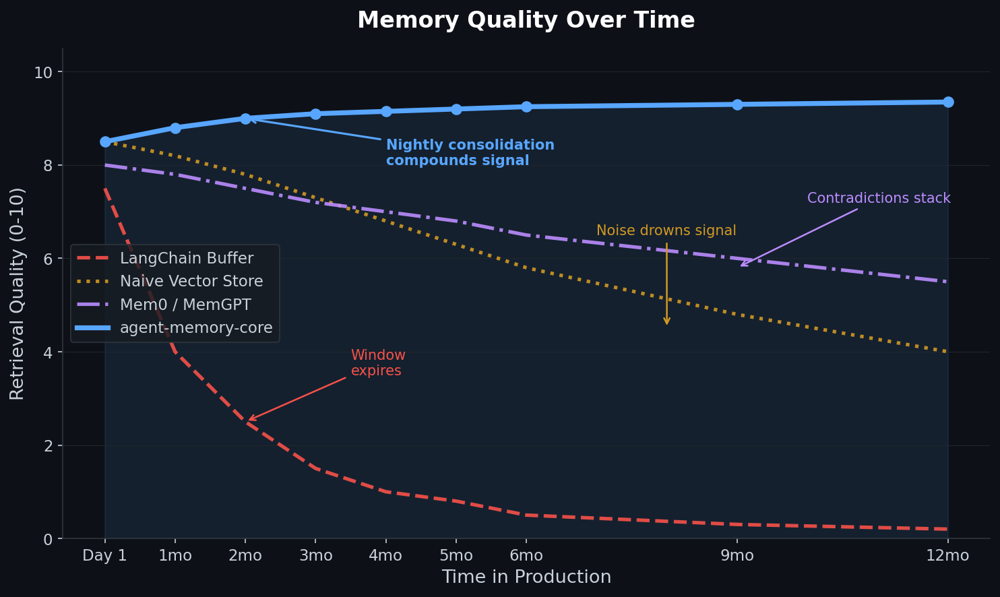
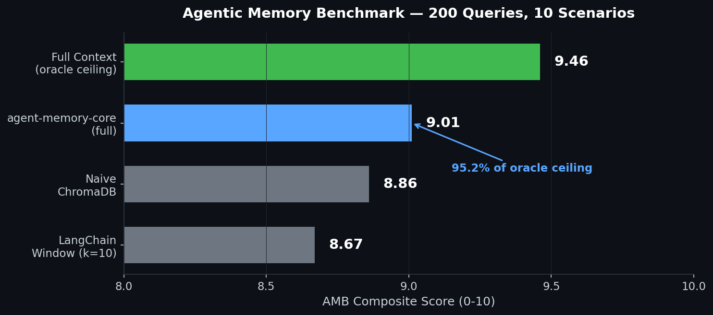
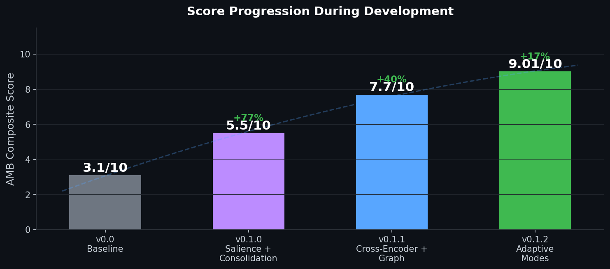

# agent-memory-core

**The only agent memory that gets better over time.**

Most AI memory systems degrade in production. LangChain's buffer window expires by design. Naive vector stores drown in noise as data accumulates. Even Mem0 and MemGPT stack contradictions until retrieval precision collapses. After six months of real use, they're all worse than day one.

agent-memory-core is built around **intelligent forgetting**. Nightly consolidation compresses episodic memories into durable semantic knowledge — the same way sleep consolidates human memory. Credentials never decay. Stale project status auto-archives. Contradictions resolve toward newer truth. The result: retrieval quality that **compounds** instead of degrading.

## Performance Over Time



Every other system trends down. agent-memory-core trends up. Nightly consolidation compresses noise out and strengthens signal — so month 6 is better than month 1, not worse.

## Benchmark Results

Scored on the [Agentic Memory Benchmark](benchmark/README.md): **200 queries** across **10 real-world scenarios**, with adversarial traps designed to expose exactly where naive systems fail.



| System | Composite | Recall@5 | Precision@5 | Answer | Temporal | Contradiction |
|---|---|---|---|---|---|---|
| **agent-memory-core** | **9.01/10** | 95% | 95% | 69% | 100% | 94% |
| Naive ChromaDB | 8.86/10 | 95% | 95% | 63% | 100% | 94% |
| LangChain Window (k=10) | 8.67/10 | 90% | 90% | 65% | 100% | 92% |
| *Oracle ceiling (full context)* | *9.46/10* | *97%* | *97%* | *84%* | *100%* | *96%* |

**95.2% of oracle ceiling** — and closing. The top-line gap to naive looks small until you break it down by reasoning type:

### Where It Actually Matters


Simple lookups are easy — everything scores ~9. The real test is **temporal reasoning**, **multi-hop chains**, and **lessons learned from past mistakes**. That's where naive systems silently return the wrong version of a changed fact, and where agent-memory-core pulls ahead.

### Development Progression

Built in one week. Eval-driven from day one.



Every improvement was measured before and after against the same 200-query benchmark. No guessing, no "feels better" — just numbers.

## Quickstart

```bash
pip install agent-memory-core
```

```python
from agent_memory_core import MemoryStore

store = MemoryStore()
store.add("The API key is in the keychain", type="credential")
store.add("Project uses Python 3.12", type="technical")

results = store.search("Where is the API key?")
print(results[0].text)  # "The API key is in the keychain"
```

## 7 Capabilities

1. **Salience-weighted retrieval** — credentials surface over stale session logs automatically. Type priors, access count, and graph connectivity all feed the score. On by default.

2. **Adaptive query intent detection** — "where is the API key" routes as similarity-heavy. "Current project status" routes as recency-heavy. Weights adjust per query without configuration.

3. **Cross-encoder re-ranking** — two-stage retrieval: embed wide, re-rank with `cross-encoder/ms-marco-MiniLM-L-6-v2`. Adds ~8% recall on adversarial queries.

4. **MMR diversity** — Maximal Marginal Relevance prevents five results that all say the same thing. Retrieval covers the space, not just the centroid.

5. **Nightly lossy consolidation** — episodic chunks compress into stable semantic facts via local LLM (Mistral/Qwen via Ollama). Originals archived, never deleted. This is what drives long-horizon improvement.

6. **Entity relationship graph** — memory files linked by shared entities and topics. Two-hop neighbor expansion surfaces related context.

7. **Working memory buffer** — 4-7 short-term slots (Miller's Law) that survive session restarts. `flush()` serializes to long-term store.

## How It Compares

| Feature | agent-memory-core | LangChain | Naive Vector | Mem0 | MemGPT |
|---|---|---|---|---|---|
| Nightly consolidation | Yes (local LLM) | No | No | Partial | Yes (GPT-4 only) |
| Active forgetting | Yes | No | No | No | No |
| Contradiction resolution | Yes | No | No | Partial | Partial |
| Salience scoring | Yes (type + access + graph) | No | No | Partial | No |
| Entity graph | Yes | No | No | No | No |
| Agent namespacing | Yes | No | No | No | No |
| Eval harness included | Yes (AMB, 200 queries) | No | No | No | No |
| Self-maintenance cron | Yes | No | No | No | No |
| Runs fully local | Yes (Ollama + ChromaDB) | Partial | Yes | No | No |
| License | Apache 2.0 | MIT | -- | MIT | Apache 2.0 |

## Architecture

```
store.add(text, type, source, agent)
  ├── ChromaDB upsert (always)
  └── Hindsight retain (optional, graceful fallback)

store.search(query, n, type, since, agent)
  ├── 1. ChromaDB cosine retrieval (4x candidate pool)
  ├── 2. Salience + recency scoring (adaptive weights per query type)
  ├── 3. Cross-encoder re-ranking (optional, ms-marco-MiniLM)
  ├── 4. MMR diversity selection (lambda=0.7)
  ├── 5. Atomic fact augmentation
  └── 6. Dynamic tail pruning

WorkingMemory (JSON buffer, 4-7 slots)
  └── flush() → MemoryStore.add(..., type="session")

Nightly Consolidation (cron, requires Ollama)
  ├── Cluster chunks by source + type + entity co-occurrence
  ├── Compress clusters via local Mistral/Qwen
  ├── Decompose into atomic facts
  └── Archive originals (soft delete, never hard delete)

MemoryGraph (entity extraction + 2-hop expansion)
ForgettingPolicy (salience decay + stale detection + health scoring)
```

## Installation

```bash
# Core
pip install agent-memory-core

# With cross-encoder re-ranking
pip install "agent-memory-core[reranker]"

# With graph operations
pip install "agent-memory-core[graph]"

# Everything
pip install "agent-memory-core[reranker,graph]"
```

**Requirements:** Python >= 3.10, chromadb >= 0.5.0

**Optional:** Ollama with `mistral:latest` or `qwen2.5:7b` for consolidation and graph enrichment.

## Advanced Usage

### Working Memory

```python
from agent_memory_core import WorkingMemory, MemoryStore

store = MemoryStore()
wm = WorkingMemory(max_slots=7)

wm.add("User prefers terse responses")
wm.add("Currently debugging the auth flow")

# Flush to long-term at session end
wm.flush(store)
```

### Consolidation (requires Ollama)

```python
from agent_memory_core import MemoryStore, Consolidator

store = MemoryStore()
consolidator = Consolidator(store, min_cluster=3)

# Preview without writing
report = consolidator.run(dry_run=True)
print(f"Would consolidate {report['clusters_viable']} clusters")

# Run for real
report = consolidator.run()
print(f"Archived {report['archived']} chunks into {report['consolidated']} facts")
```

### Eval Against Your Data

```python
from agent_memory_core import MemoryStore, MemoryEval

store = MemoryStore()
ev = MemoryEval(store)

ev.add_query(
    "Where is the API key?",
    expected_facts=["keychain"],
    type="credential"
)

report = ev.run(n=5, version="my-config")
print(f"Score: {report['composite']}/10")
```

### Agent Namespacing

```python
# Shared memory — visible to all agents
store.add("Project uses Python 3.12", type="technical")

# Agent-private memory
store.add("Internal scratchpad", type="session", agent="cipher")

# Search sees shared + agent-private
results = store.search("Python version", agent="cipher")
```

### Valid Chunk Types

```python
VALID_TYPES = {
    "fact", "personal", "professional", "credential", "financial",
    "goal", "project_status", "technical", "session", "task",
    "observation", "dream", "lesson",
}
```

Each type carries a salience prior and temporal decay rate. `credential` and `lesson` never decay. `session` decays aggressively after 30 days.

## License

Apache 2.0. See [LICENSE](LICENSE).
