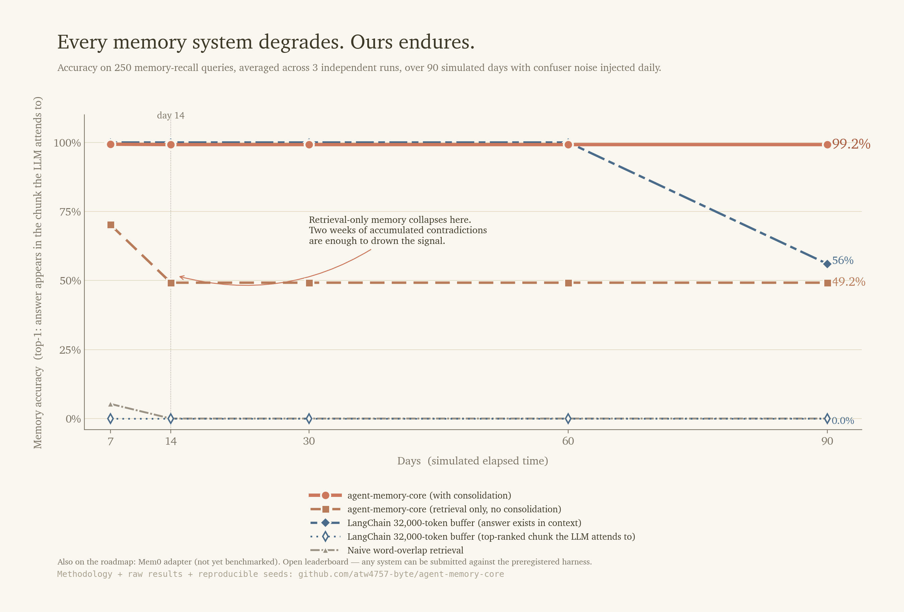

# agent-memory-core

**Every memory system degrades. Ours endures.**

Agents remember what users tell them — until a user changes their mind. *"My dog's name is Max"* today, *"actually it's Milo"* tomorrow. Both sit in memory. At query time, the retriever returns whichever scores higher, and the agent confidently contradicts itself. The **Agentic Memory Benchmark v2.3** injects this class of contradictory fact daily across a simulated 90-day horizon and measures which systems resolve the contradiction — and which drown in it.



> **At 250-query scale, 3-seed mean, over 90 simulated days:**
> - **agent-memory-core (with consolidation): 99.2% top-1** — flat from day 7 to day 90
> - **Same retriever, no consolidation: 49.2%** — collapses after 13 days of accumulated contradictions
> - **LangChain 32k-token buffer (top-1): 0.0%** — answer exists in context, but top-ranked chunk is noise
> - **Naive word-overlap: 0.0%** — never resolves a single contradiction

Full results, seeds, and reproducible harness: [`benchmark/amb_v2/results/v2.3/large/STATUS.md`](benchmark/amb_v2/results/v2.3/large/STATUS.md). Preregistered: [`benchmark/amb_v2/PREREGISTERED.md`](benchmark/amb_v2/PREREGISTERED.md).

- **Supersede-aware consolidation.** When a new fact contradicts an old one, the old fact is archived with a link to what replaced it — not left to compete at retrieval time.
- **Ranked top-1 retrieval.** The chunk the LLM actually attends to is earned, not handed out by recency.
- **Credentials never decay.** Type-aware salience keeps high-value facts retrievable after any volume of noise.
- **Replay any recall.** Trace every retrieval event back to its source chunks — answer *"why did it remember that?"*
- **Local-first.** Runs entirely on ChromaDB + Ollama. Your memory never leaves your machine unless you opt in.

Apache 2.0. `pip install archon-memory-core`. Python ≥ 3.10. (Import as `from agent_memory_core import …` — module name unchanged.)

---

## Why this exists

Every production agent hits the same wall. The naive approach — dump everything into a vector store, retrieve by cosine — works on day one. By month three you're drowning in stale context, duplicated noise, and contradictory facts that silently return the wrong answer.

LangChain's buffer expires by design. Mem0 stores contradictions without resolving them. MemGPT's consolidation only runs on GPT-4. `agent-memory-core` is the answer to the question none of them asked: *what if memory got **better** the longer you used it?*

See [**Why not just use a bigger context window?**](docs/WHY_NOT_CONTEXT_WINDOW.md) for the cost/quality math against the most common alternative.

---

## Quickstart

```bash
pip install archon-memory-core
```

```python
from agent_memory_core import MemoryStore

store = MemoryStore()
store.add("The production API key lives in the keychain", type="credential")
store.add("Project uses Python 3.12 with uv for lockfile management", type="technical")

results = store.search("where is the API key?")
print(results[0].text)
# "The production API key lives in the keychain"
```

### Async-first (recommended for agents)

```python
from agent_memory_core import AsyncMemoryStore

store = AsyncMemoryStore()
await store.add("User prefers terse responses", type="personal")
results = await store.search("user communication preferences")
```

### With LangChain

```python
from langchain.agents import AgentExecutor
from agent_memory_core.integrations.langchain import AgentMemoryStore

memory = AgentMemoryStore()
agent = AgentExecutor(..., memory=memory)
```

### With LlamaIndex

```python
from llama_index.core.agent import ReActAgent
from agent_memory_core.integrations.llamaindex import AgentMemoryStore

memory = AgentMemoryStore()
agent = ReActAgent.from_tools(..., memory=memory)
```

See [`docs/INTEGRATIONS.md`](docs/INTEGRATIONS.md) for the full adapter reference.

---

## The Benchmark — AMB v2.3

The **Agentic Memory Benchmark v2.3** is the longitudinal, preregistered test that separates systems that *remember* from systems that merely *store*. Contradictory facts are injected every day for 90 simulated days; the primary metric is **top-1 accuracy** — whether the chunk the LLM actually attends to contains the answer.

### v2.3 large-scale results (250 queries × 2,300 confusers · 3-seed mean)

| System | Mode | Day 7 | Day 14 | Day 30 | Day 60 | Day 90 |
|---|---|---:|---:|---:|---:|---:|
| **agent-memory-core** | tuned (with consolidation) | **99.3%** | **99.2%** | **99.2%** | **99.2%** | **99.2%** |
| agent-memory-core | stock (retrieval only) | 70.2% | 49.2% | 49.2% | 49.2% | 49.2% |
| LangChain 32k buffer | any-in-context | 100% | 100% | 100% | 100% | 56% |
| LangChain 32k buffer | top-1 | 0.0% | 0.0% | 0.0% | 0.0% | 0.0% |
| Naive word-overlap | — | 5.0% | 0.0% | 0.0% | 0.0% | 0.8% |

Standard deviation ≤ 0.01 on every cell. Seeds: 42, 43, 44. Full per-seed breakdown and raw JSON: [`benchmark/amb_v2/results/v2.3/large/STATUS.md`](benchmark/amb_v2/results/v2.3/large/STATUS.md).

**The LangChain split is the v2.3 thesis.** The answer exists in the 32k-token buffer right up to day 60 — but the top-ranked chunk (what the LLM attends to) is the most recent addition, which is usually a confuser. *Context length ≠ memory without ranking.*

**AMB is an open leaderboard.** Mem0, MemGPT, Letta, pgvector pipelines, custom builds — submit against the preregistered harness. See [`benchmark/LEADERBOARD.md`](benchmark/LEADERBOARD.md). Mem0 adapter is on the roadmap; any framework can be contributed as a PR.

### Reproduce

```bash
git clone https://github.com/atw4757-byte/agent-memory-core
cd agent-memory-core/benchmark/amb_v2
make bench                    # runs the full v2.3 grid (~20 min on M-series)
```

Seeds, scenarios, confusers, and adapter code are all in the repo. Preregistered protocol: [`PREREGISTERED.md`](benchmark/amb_v2/PREREGISTERED.md).

See [**Why not just use a bigger context window?**](docs/WHY_NOT_CONTEXT_WINDOW.md) for the cost/quality math.

---

## Architecture

```
store.add(text, type, source, agent)
  ├── ChromaDB upsert (always)
  └── Hindsight retain (optional, graceful fallback)

store.search(query, n, type, since, agent)
  ├── 1. Cosine retrieval (4x candidate pool)
  ├── 2. Salience + recency scoring (adaptive per query type)
  ├── 3. Cross-encoder re-ranking (ms-marco-MiniLM, optional)
  ├── 4. MMR diversity selection (λ=0.7)
  ├── 5. Atomic fact augmentation
  └── 6. Dynamic tail pruning

WorkingMemory (4-7 slots, Miller's Law)
  └── flush() → long-term store

Nightly Consolidation (local Mistral/Qwen via Ollama)
  ├── Cluster by source + type + entity co-occurrence
  ├── Compress clusters into semantic facts
  ├── Resolve contradictions toward newer truth
  └── Archive originals (soft delete, never hard delete)

MemoryGraph      — entity extraction + 2-hop expansion
ForgettingPolicy — salience decay + stale detection + health scoring
```

---

## How it compares

| Feature | agent-memory-core | LangChain | Naive Vector | Mem0 | MemGPT |
|---|---|---|---|---|---|
| Nightly consolidation | Local LLM | — | — | Partial | GPT-4 only |
| Active forgetting | Yes | — | — | — | — |
| Contradiction resolution | Yes, logged | — | — | Partial | Partial |
| Salience scoring | Type + access + graph | — | — | Partial | — |
| Entity graph | Yes | — | — | — | — |
| Agent namespacing | Yes | — | — | — | — |
| Replay / observability | Yes | — | — | — | — |
| Eval harness included | AMB (200 queries) | — | — | — | — |
| Self-maintenance cron | Yes | — | — | — | — |
| Runs fully local | Ollama + ChromaDB | Partial | Yes | — | — |
| License | Apache 2.0 | MIT | — | MIT | Apache 2.0 |

Own a system on this list and disagree? [Submit a correction](https://github.com/atw4757-byte/agent-memory-core/issues/new).

---

## Advanced usage

### Working Memory

```python
from agent_memory_core import WorkingMemory, MemoryStore

store = MemoryStore()
wm = WorkingMemory(max_slots=7)
wm.add("User prefers terse responses")
wm.flush(store)  # end-of-session persistence
```

### Consolidation (requires Ollama)

```python
from agent_memory_core import Consolidator

consolidator = Consolidator(store, min_cluster=3)
report = consolidator.run(dry_run=True)
print(f"Would consolidate {report['clusters_viable']} clusters")

report = consolidator.run()
print(f"Archived {report['archived']} chunks into {report['consolidated']} facts")
```

### Eval Against Your Data

```python
from agent_memory_core import MemoryEval

ev = MemoryEval(store)
ev.add_query("Where is the API key?", expected_facts=["keychain"], type="credential")

report = ev.run(n=5, version="my-config")
print(f"Score: {report['composite']}/10")
```

### Agent Namespacing

```python
store.add("Project uses Python 3.12", type="technical")              # shared
store.add("Internal scratchpad", type="session", agent="cipher")     # agent-private

results = store.search("Python version", agent="cipher")  # sees shared + cipher
```

### Valid Chunk Types

```python
VALID_TYPES = {
    "fact", "personal", "professional", "credential", "financial",
    "goal", "project_status", "technical", "session", "task",
    "observation", "dream", "lesson",
}
```

`credential` and `lesson` never decay. `session` decays aggressively after 30 days.

---

## Installation

```bash
pip install archon-memory-core                     # core
pip install "archon-memory-core[reranker]"         # + cross-encoder
pip install "archon-memory-core[graph]"            # + entity graph
pip install "archon-memory-core[langchain]"        # + LangChain adapter
pip install "archon-memory-core[llamaindex]"       # + LlamaIndex adapter
pip install "archon-memory-core[all]"              # everything
```

The PyPI project is named `archon-memory-core` (the short name was claimed before we launched). The Python module stays `agent_memory_core`, so existing code doesn't change — just the `pip install` line.

**Requirements:** Python ≥ 3.10, chromadb ≥ 0.5.0.
**Optional:** Ollama with `mistral:latest` or `qwen2.5:7b` for consolidation.

---

## Roadmap

- **Q2 2026 — shipped:** AMB v2.3 longitudinal benchmark (90-day simulated decay, daily contradiction injection, preregistered grid). Public leaderboard live.
- **Q2 2026 — in flight:** Mem0 + MemGPT + Letta adapters submitted to the leaderboard. Hosted dashboard at [divergencerouter.com/amc/](https://divergencerouter.com/amc/).
- **Q3 2026:** Pro tier (memory health dashboard, eval runs, replay debugger). See [ROADMAP.md](ROADMAP.md) and [PRICING.md](PRICING.md).
- **Q4 2026:** Multilingual benchmark suite. Enterprise private-VPC deploy.

---

## Pricing

Free forever. The OSS library is complete and will remain so.

Paid tiers for observability, evals, team features, and hosted services are on the roadmap — see [PRICING.md](PRICING.md) for the tier structure and [ENTERPRISE.md](ENTERPRISE.md) for private-deploy details.

---

## License

Apache 2.0. See [LICENSE](LICENSE).

## Contributing

See [CONTRIBUTING.md](CONTRIBUTING.md). Benchmarks, adapters, and bug reports especially welcome.
